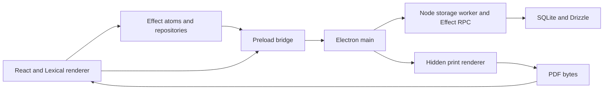

# Missal performance and resilience plan

Status: expanded draft, grounded in source inspection and a local template-format study on 2026-09-30. Application performance measurements and runtime implementation are pending.

Make Missal responsive and predictable on a Windows laptop with 4 GB RAM, 2 CPU cores, and slow storage. Reduce unnecessary work, bound resource use, and give failures a clear recovery path. Preserve FIR data, document revisions, Urdu layout, and the existing editing workflow.

Ship 100 text-only templates by default. Convert them at build time and keep their document bodies out of initial renderer loading. Treat first installation, unchanged launches, and pack updates as separate workloads.

Improve one measured bottleneck at a time. Treat proposed optimizations as hypotheses until a repeatable experiment supports them.

## Current architecture and evidence



The code already makes several useful performance choices. Keep these as the starting point:

| Existing choice                                                                                                           | Source                                                                                                                                                                                            | Consequence for this plan                                                                                                              |
| ------------------------------------------------------------------------------------------------------------------------- | ------------------------------------------------------------------------------------------------------------------------------------------------------------------------------------------------- | -------------------------------------------------------------------------------------------------------------------------------------- |
| SQLite and migrations run in a Node worker. Main starts loading the storage host after creating the window.               | [main.ts](../src/main.ts), [storage-worker-client.ts](../src/electron/storage-worker-client.ts), [storage-worker.ts](../src/storage-worker.ts)                                                    | Preserve database ownership. Measure both first paint and data readiness; creating a window alone does not prove that startup is fast. |
| React Compiler and route code splitting are enabled.                                                                      | [vite.renderer.config.ts](../vite.renderer.config.ts)                                                                                                                                             | Inspect compiler diagnostics and emitted chunks before adding manual memoization or new loading boundaries.                            |
| FIR rows use fixed-height virtualization designed around React Compiler.                                                  | [data-table.tsx](../src/components/data-table.tsx), [use-virtual-rows.ts](../src/hooks/use-virtual-rows.ts)                                                                                       | Measure filtering, sorting, and synchronous scroll updates. Virtualization already bounds row DOM creation.                            |
| Document bodies are separate from summaries. Saves update the cached body from an acknowledgement.                        | [atoms.ts](../src/state/atoms.ts), [repositories.ts](../src/electron/repositories.ts)                                                                                                             | Preserve the small save response and avoid downloading the body immediately after saving.                                              |
| Document atoms have a one-minute idle TTL. Several catalog and list atoms stay alive.                                     | [atoms.ts](../src/state/atoms.ts)                                                                                                                                                                 | Measure retained memory and invalidation scope before changing cache lifetimes.                                                        |
| DOCX libraries, PDF.js, and the command dialog load on demand.                                                            | [session.ts](../src/editor/session.ts), [docx.ts](../src/editor/import/docx.ts), [print-preview.tsx](../src/components/print-preview.tsx), [command-menu.tsx](../src/components/command-menu.tsx) | Confirm what remains in initial and editor-route chunks.                                                                               |
| Print jobs share a serialized hidden window with a two-minute idle lifetime. Preview pages release canvases when distant. | [print-pdf.ts](../src/electron/print-pdf.ts), [print-preview.tsx](../src/components/print-preview.tsx)                                                                                            | Preserve print isolation and canvas cleanup. Measure the memory cost of keeping the window warm.                                       |
| Storage crosses renderer, main, and worker as JSON strings.                                                               | [storage-contract.ts](../src/electron/storage-contract.ts)                                                                                                                                        | This deliberately avoids cloning deep document objects at both hops. Compare alternatives before changing the transport.               |

Source inspection identifies these investigation targets. Their runtime impact has not been measured:

- `FirRepository.list` returns every FIR summary. `firsAtom` keeps that list alive, and `latestFirsAtom` sorts the whole list to select five sidebar items.
- `templatesAtom` retains the full template summary list. Template filtering and command scoring operate in the renderer; command scoring sorts all matches before selecting twenty.
- Some FIR invalidation keys refresh multiple cached entities. Trace the actual reads triggered by each mutation before narrowing them.
- The editor session publishes a fresh UI snapshot on dirty content updates. React may already skip unchanged primitive state updates. Measure listener work and committed renders separately.
- PDF loading requests page metadata for every page with `Promise.all`. Each page component also creates its own visibility observer.
- The print promise chain has no admission limit. Font readiness, image readiness, and print operations have no application deadline in this module.
- Storage calls expose promises without an explicit cancellation protocol at the preload boundary. The host has no application-level readiness deadline or health state.
- Bundled-template synchronization runs during storage initialization. It retains every pending envelope before applying one transaction. It also reads and links changed bodies before checking whether their templates were edited or deleted. Field resolution rebuilds the catalog index repeatedly. Measure first install separately from unchanged-pack startup.

## Measurement contract

Use the confirmed Windows hardware for acceptance measurements. Record the actual CPU, storage type, free RAM, Windows version, and power mode. Chromium CPU throttling can help compare renderer experiments locally, but does not reproduce slow storage or whole-app memory pressure.

Use packaged release builds for timing and memory results. Use a separate diagnostic build for React profiling. Development Strict Mode, HMR, open DevTools, and profiling overhead must not contaminate release measurements. Launch development through `vp run dev`; package through `vp run package`.

Create synthetic, deterministic datasets in an isolated benchmark profile:

| Fixture | Workload                                                                                            |
| ------- | --------------------------------------------------------------------------------------------------- |
| Small   | 100 FIRs, 100 bundled templates, 1–5 page text documents                                            |
| Normal  | 5,000 FIRs, 100 bundled and 100 user templates, 5–20 page text documents                            |
| Stress  | 25,000 FIRs, 100 bundled and 400 user templates, 50–100 page text documents and dense linked fields |

Keep the application userData profile separate from benchmark storage. Record fixture seeds, hashes, document sizes, node counts, image dimensions, and page counts. Include Urdu text, bidirectional content, and Word formatting so a speedup cannot hide lost fidelity.

Measure these scenarios:

1. Launch with an existing database and unchanged bundled templates. Record process launch, window visibility, first paint, and usable FIR list separately.
2. Launch a fresh profile with migrations and bundled-template installation. Repeat after a pack update.
3. Search, sort, select, and scroll FIRs. Open the command menu and search templates.
4. Open a FIR, switch its documents, type Urdu text, change linked values, undo, and save while continuing to type.
5. Import representative DOCX files and paste formatted Word content.
6. Open a print preview, scroll and zoom it, print, close it, and reopen it.
7. Repeat document switching and preview cycles thirty times. Observe memory after atom TTL expiry and hidden-window closure.
8. Exercise the failure scenarios described below, including quit during an active operation.

Collect renderer interaction latency and long tasks, React commit duration and count, main event-loop delay, storage query duration, serialization duration and bytes, pending job counts, CPU, and total private memory across app processes. Include the hidden print renderer and GPU process. The storage worker shares the main process, so do not count it as a second process.

Use low-frequency process samples and bounded diagnostic buffers. Save operation names, IDs, durations, sizes, and error categories without document text. Electron provides process metrics and cross-process tracing; use those alongside renderer traces and Node worker profiles. See [Electron app metrics](https://www.electronjs.org/docs/latest/api/app#appgetappmetrics) and [content tracing](https://github.com/electron/electron/blob/main/docs/api/content-tracing.md).

### Proposed budgets

These are initial engineering targets for the normal fixture on the confirmed machine. Phase 0 must establish whether they are realistic. Record any adjustment and its evidence before optimization begins.

| Metric                                      | Initial target                                                                                                                          |
| ------------------------------------------- | --------------------------------------------------------------------------------------------------------------------------------------- |
| Existing-profile launch to usable FIR list  | Median at most 3 seconds; p95 at most 5 seconds                                                                                         |
| Typing and search input response            | p95 at most 50 ms                                                                                                                       |
| Cached document switch                      | p95 at most 250 ms                                                                                                                      |
| Save a representative 10-page text document | p95 at most 500 ms, including acknowledgement                                                                                           |
| Idle CPU after background work settles      | Below 1% of total machine capacity on average                                                                                           |
| Total app private memory                    | At most 350 MB idle, 500 MB during normal editing, and 750 MB during a 20-page preview                                                  |
| Repeated workflow memory                    | No continuing growth after caches and print resources expire; investigate more than 10% retained growth against the stabilized baseline |

Record import and preview preparation separately by file size and page count. Set their latency budgets after collecting the baseline. Keep the shell responsive during those operations. Also track working set and OS paging; private memory alone does not explain pressure on a 4 GB machine.

### Hill-climbing rules

For every experiment, record the hypothesis, exact source state, fixture, changed variable, raw samples, primary metric, secondary regressions, and decision. A commit ID alone is insufficient when the working tree contains changes; record the patch hash too.

1. Establish repeatability before changing code. Separate first-run startup, subsequent process launches, and verified cold-storage runs.
2. Rank candidates by measured user delay, resource cost, implementation complexity, and confidence.
3. Change one mechanism per experiment. Keep dependency upgrades separate.
4. Alternate baseline and candidate runs on the same machine. Use at least ten launch samples and thirty interaction samples for screening. Use larger runs to validate p95.
5. Keep a performance change when the primary gain exceeds measured variation and secondary metrics stay within budget. Use 10% as an initial screening threshold, not as proof.
6. Keep a resilience or simplification change when its behavior is proven and its performance cost stays within budget. Record the tradeoff explicitly.
7. Revert candidates that add complexity without a repeatable benefit. Refresh the baseline after each accepted change and re-profile before selecting the next one.

This follows Electron's recommendation to repeatedly profile and optimize the running application. See [Electron performance guidance](https://www.electronjs.org/docs/latest/tutorial/performance).

## Intended ownership

Keep one SQLite owner and a small main process. Give every background operation an owner, a bounded admission policy, and a defined lifetime.

| Component                 | Owns                                                                                     |
| ------------------------- | ---------------------------------------------------------------------------------------- |
| React components          | Urgent input, local view state, accessible loading and recovery states                   |
| Lexical editor session    | Live document state, content revision, history, save lock, and editor registrations      |
| Effect atoms              | Shared query results, bounded cache retention, entity invalidation, and mutation results |
| Renderer repositories     | Typed calls and conversion between transport results and domain errors                   |
| Preload and main adapters | Sender validation, request ownership, and forwarding without document parsing            |
| Storage worker            | Database initialization, queries, transactions, revisions, and storage diagnostics       |
| Print service             | One hidden window, job admission, print ordering, preview supersession, and cleanup      |

Suggested caller contracts are design sketches, not new APIs implemented by this draft:

```text
firQueries.recent({ limit: 5 })
firQueries.page({ filter, sort, page, pageSize })
templateQueries.search({ query, limit: 20 })
printService.preview({ ownerId, requestId, html })
printService.print({ ownerId, requestId, html })
```

Repository callers receive domain results and typed failures. They do not coordinate worker restarts or hidden-window lifetimes. The editor retains its draft when storage becomes unavailable. A successful save means storage acknowledged the expected revision, not merely that the UI stopped waiting.

## Phase 0: build the baseline and repeatable checks

### Align Effect before collecting the performance baseline

Target `4.0.0-rc.118`, the newest published Effect 4 release checked on 2026-09-30. The npm `rc` tag points to this version; the stable `latest` tag points to `3.22.2`. Missal already uses Effect 4, so this plan follows the newest v4 release. See the [npm release metadata](https://registry.npmjs.org/effect) and [rc.118 release notes](https://github.com/Effect-TS/effect/releases/tag/effect%404.0.0-rc.118).

- [ ] Recheck release tags at implementation time. Pin `effect`, `@effect/atom-react`, `@effect/platform-node`, `@effect/sql-sqlite-node`, and `@effect/vitest` to the same verified v4 release. All five currently publish `4.0.0-rc.118` under `rc`.
- [ ] Migrate `effect/unstable/reactivity`, `effect/unstable/rpc`, schema JIT, and SQL imports to the corresponding `effect/*` paths. Update nested imports and test setup too. rc.118 removes the old exports; the moved APIs still have unstable status.
- [ ] Check Drizzle's Effect integration against the new exports. The installed Drizzle declarations still reference `effect/unstable/sql/SqlError`; inspect runtime imports and use a compatible release if necessary.
- [ ] Run installation, checks, tests, packaging, and a desktop storage/editor/preview smoke check. Include saved-data compatibility and worker startup.
- [ ] Record the upgrade as a separate change. Establish the optimization baseline after this migration so upstream fixes do not get attributed to app changes.

rc.118 includes fixes for atom dependency lifetimes and retained builds, plus allocation reductions in fibers and schema traversal. These are relevant to the plan, but release notes do not establish a measured improvement in Missal. Compare the upgrade separately, then profile the new baseline.

### Add the measurement tools

- [ ] Add fixture generation, scenario execution, and result comparison under a dedicated performance-script directory. Expose commands through `vp run` scripts.
- [ ] Add opt-in marks around startup, storage initialization, IPC encoding and decoding, query execution, editor capture, DOCX stages, print layout, and PDF rendering.
- [ ] Capture release bundle graphs and compiler diagnostics. Identify initial-route imports, editor-route imports, and actual heavy chunks.
- [ ] Collect baseline results on the confirmed machine and a development machine. Preserve raw results and environment metadata.
- [ ] Add fault-injection entry points confined to test and diagnostic builds.
- [ ] Freeze metric definitions, fixtures, and acceptance budgets before implementation experiments.

Exit condition: a second run reproduces the baseline closely enough to distinguish a useful improvement. Runtime work starts with whichever measured bottleneck affects users most. The phase order below is provisional.

## Phase 1: ship and install 100 text-only templates efficiently

### Evidence and format comparison

The repository currently contains one authored Word template and one compiled envelope. The compiled JSON is 856,792 bytes, about 837 KiB, with no embedded images. Gzip reduces that envelope to 23,294 bytes. One hundred similarly sized envelopes total about 81.7 MiB uncompressed or 2.2 MiB as individually compressed documents. This is a sizing estimate based on the current template, not a claim about 100 distinct authored templates.

A repeatable [format-study script](../scripts/performance/template-pack-study.py) compares eager JSON installation, bounded JSON installation, compressed deltas, and seed copying. The [raw results](template-pack-study.json) record the synthetic corpus, environment, and limitations.

```bash
python scripts/performance/template-pack-study.py --count 100 --batch-size 4 --output docs/template-pack-study.json
```

The local exploratory run produced these results:

| Method                                   | Time         | Additional peak process memory |
| ---------------------------------------- | ------------ | ------------------------------ |
| Decode all JSON bodies, then insert      | 2.45 seconds | About 426 MiB                  |
| Decode and insert four bodies per batch  | 3.15 seconds | About 21 MiB                   |
| Decode compressed JSON bodies in batches | 3.01 seconds | About 20 MiB                   |
| Copy a prebuilt seed database            | 0.43 seconds | About 2 MiB                    |
| Stream a compressed seed to disk         | 0.48 seconds | About 4 MiB                    |

This Python study uses a minimal SQLite table, repeated copies of one document, warm Linux storage, and one sample per method. It excludes Effect, Drizzle, field linking, projections, fsync, atomic publication, and app startup. It demonstrates the allocation and serialization difference between formats. Validate the final choice with the real initializer, 100 distinct templates, and the Windows target. Batching trades some throughput for bounded memory; a seed avoids runtime parsing on fresh installation.

### Recommended distribution

Extend the existing `vp run templates:build` pipeline to produce three artifacts from the same converted envelopes:

1. A small versioned manifest with pack hash, schema and converter versions, template identity, display name, body hash, source Word hash, decoded byte count, and field bindings.
2. A compressed seed SQLite snapshot generated through Missal's real migrations and template initializer in an isolated build profile. It contains the 100 templates, resolved fields, summary projections, and installation metadata.
3. Individually compressed portable envelopes for delta installation into existing profiles. Fields remain portable by name and source binding rather than carrying the seed database's local IDs.

This uses one writable application database. The seed is a build artifact copied only into a new profile, not another live database the renderer must query. The extra compressed delta representation supports small updates without unpacking the whole seed. In the synthetic study the compressed seed and deltas together occupy about 4.5 MiB; a real seed includes more tables and metadata.

Keep ordinary generated bodies outside the JavaScript bundle. Ship the compressed seed, manifest, and deltas as resources. Verify the packaged app does not also ship uncompressed envelopes, source Word files, or duplicate resource folders. ASAR improves packaging of small files, but is not itself a compression strategy. See [Electron ASAR packaging](https://github.com/electron/electron/blob/main/docs/tutorial/asar-archives.md).

Use content-hash filenames for bodies. Keep bundle identity separate from display name and artifact location. Preserve the established source-name identity for existing entries when migrating metadata; renaming a source file continues to create a new bundled template unless that behavior is deliberately redesigned.

Compare gzip at a moderate build-time compression level with a plain seed on the Windows machine. Streaming decompression must not read the entire archive into a buffer. Keep the bounded delta installer as the simpler fallback if the real seed build or compatibility checks do not justify the additional path.

### Fresh profile

1. Acquire exclusive ownership of profile bootstrap before checking whether the database exists. Never copy a seed over an existing database or decide that a corrupt existing database is an empty profile.
2. Stream the seed to a scoped temporary file in the target directory. Verify its byte count, hash, and supported schema before publication.
3. Close file handles, flush the destination as required, and publish under the bootstrap ownership policy. Recover leftover temporary files after an interrupted first launch.
4. Open the published database through the normal worker runtime. Verify migrations and installed-pack metadata. All 100 template summaries are then available together.
5. Load a template body only when a user opens it or copies it onto a FIR. Keep summary queries separate from document bodies.

Build snapshots from a closed, complete database. Do not copy a live database without accounting for journals or WAL sidecars. Use SQLite's supported snapshot/backup approach when a live source cannot be closed. See [SQLite backup guidance](https://www.sqlite.org/backup.html).

### Existing profile and updates

Open and migrate the user's database before optional pack synchronization. Replace the current startup-blocking `Layer.effectDiscard` synchronization with one scoped background pack job. Required migrations still finish before repository reads.

1. Compare the stored completed-pack hash with the manifest. An unchanged launch opens no template bodies, creates no templates, and performs no catalog writes.
2. If the pack changed, read small installation metadata and current template revisions in one bounded query. Plan each entry as `Unchanged`, `Install`, `UpdateUntouched`, `KeepEdited`, or `KeepDeleted`.
3. Skip body reads, field creation, and document projection for edited and deleted entries. Advance their observed pack metadata without changing the user's template or resurrecting a deletion.
4. Read and decode only eligible delta bodies outside the transaction. Start with one preparation task and batches of at most four templates and four MiB of uncompressed input. Bound a single document separately.
5. Inside one serialized transaction, recheck revisions and tombstones. Resolve references with one catalog index keyed by normalized label and source binding. Update that index as new fields are created. Commit fields, template changes, and installation metadata together.
6. Release prepared envelopes after commit. Emit one renderer notification and progress update per batch, then yield outside the transaction. Serve user saves between batches and measure lock time.
7. Mark the pack complete only after every entry has an acknowledged disposition. A crash resumes from committed per-entry hashes; an uncertain transaction is reconciled rather than blindly replayed.

Keep revision checks in the update predicate so a user edit made during background preparation cannot be overwritten. Preserve renamed default fields by source binding, edited templates by revision, deletion markers, and copies already attached to FIRs. Removing an entry from a pack does not delete an installed user template.

A source Word hash alone is insufficient: importer fixes can change an envelope without changing the Word file. Include the converted body and converter version in change detection. An existing metadata migration must handle the old Word-only hashes once, preserving user edits and deletions.

Model progress as a small discriminated state such as `Idle`, `Synchronizing`, `Ready`, or `PartialFailure`. Keep pack status separate from database availability. Corrupt resources produce a visible pack failure while the user's FIRs and existing templates remain usable. Cancellation and defects must not become a false successful installation.

### Build and acceptance work

- [ ] Convert Word files once per changed source or converter version. Reuse one conversion window, dispose each editor session, and cache field lookup indexes during conversion.
- [ ] Precompute summaries and portable field metadata at build time. During delta installation, rewrite field references and recompute only projections that depend on local IDs.
- [ ] Build in a staging location and validate all outputs before publishing the new manifest. A failed build keeps the previous valid pack. Do not clear the current generated folder before conversion succeeds.
- [ ] Fail validation on duplicate identities, missing bodies, bad hashes, incompatible formats, unresolved expected fields, or a seed built from stale migrations. Preserve Urdu formatting and page geometry.
- [ ] Test seed bootstrap with the actual application schema, defaults, foreign keys, revision checks, and real worker runtime. Use fixed build timestamps where reproducibility requires them.
- [ ] Test unchanged launch, one-template update, all-100 update, edited/deleted/renamed entries, field catalog changes, disk-full failure, corrupt artifacts, and interruption before publication and between transactions.
- [ ] Measure first install, list readiness, seed size, installed database size, delta peak memory, and save latency during synchronization on the Windows baseline.

Initial targets: no per-template body reads on unchanged launches; no retained array of 100 decoded bodies; all 100 summaries returned without bodies; and at most 64 MiB additional worker memory during representative delta installation. Aim for first-profile data readiness within eight seconds at p95, including seed installation. Validate or revise these budgets in Phase 0 against the real corpus.

Exit condition: the app ships 100 authored text templates, first install avoids bulk runtime document conversion, unchanged launches skip pack work, and updates preserve user changes while staying responsive and within the agreed resource limits.

## Phase 2: reduce list work and data movement

Start with a dedicated recent-FIR query. The sidebar needs five summaries, so it should not require loading and sorting the entire catalog. Reuse the existing descending-ID ordering to preserve current behavior.

- [ ] Measure summary payloads, list decode costs, full-list retention, and mutation-triggered refetches.
- [ ] Add bounded FIR queries when the normal or stress fixture justifies them. Compare server paging against retaining the full list. Use SQLite filtering and sorting if renderer work is the bottleneck.
- [ ] Define deterministic ordering and pagination semantics before implementation. Compare offset paging with cursor paging for the supported sort modes.
- [ ] Preserve keyboard navigation, selected FIR identity, select-all behavior, and bulk deletion across page boundaries. A virtual table alone does not solve query or memory cost.
- [ ] Reuse and extend the existing template search repository if renderer search is expensive. Bound results and preserve Urdu matching behavior. Compare indexed search only after query plans show a need.
- [ ] Narrow invalidation keys to affected FIRs, values, documents, and relevant lists. Preserve refreshes needed after deletion and shared-setting changes.
- [ ] Measure document atom TTL and override-cache behavior. Retain useful small metadata and release large inactive bodies according to an explicit memory budget.
- [ ] Use SQLite query plans before adding indexes. Measure insert, update, and migration costs too.

Exit condition: list and command workflows meet the agreed latency budget, memory scales with the chosen page/cache bounds, and CRUD refresh behavior remains correct.

## Phase 3: optimize React and editor updates

React Compiler already supplies automatic memoization. Check which components it compiles before adding `memo`, `useMemo`, or `useCallback`. See [React Compiler introduction](https://react.dev/learn/react-compiler/introduction).

- [ ] Profile `FirWorkspace`, `TemplateEditorForm`, `DocumentEditor`, toolbar updates, atom subscriptions, and table scrolling.
- [ ] Publish editor UI changes when visible state changes. Keep content-revision accounting internal and preserve the save-while-typing guarantee.
- [ ] Place subscriptions near the components that render their values. Derive small results in atoms where that removes repeated work or broad subscriptions.
- [ ] Split independently updating UI only where profiles demonstrate a benefit or ownership becomes clearer. Large file size alone does not prove rendering cost.
- [ ] Keep search inputs urgent. The template list and command dialog already use `useDeferredValue`; verify their benefit before extending deferred updates.
- [ ] Audit synchronous virtualizer updates against fast scroll, blank rows, keyboard focus, and React Compiler behavior before changing `flushSync`.
- [ ] Inspect editor-route imports for preview and import UI that can load later. Preserve route splitting and existing lazy modules.
- [ ] Keep editor state in Lexical. Capture and project document envelopes at operation boundaries instead of mirroring the document into React on every edit.
- [ ] Preserve `useEffectEvent` for callbacks owned by effects. Audit lifecycle boundaries and cleanup rather than using it to hide reactive dependencies. See [React useEffectEvent](https://react.dev/reference/react/useEffectEvent).

Deferred rendering changes scheduling. It does not make an expensive synchronous filter or document transform cheaper. Reduce that work or move suitable computation off the renderer thread when measurements require it.

Exit condition: typing, scrolling, and document switching meet budget without broken selection, field rendering, history, dirty state, or layout.

## Phase 4: bound Electron jobs and resource lifetimes

- [ ] Measure startup imports, migrations, bundled-template synchronization, update checks, and preload cost. Defer optional work when it delays usable UI. Keep required initialization visible to the user.
- [ ] Add a storage readiness deadline and health states such as starting, ready, unavailable, and stopping. First inspect Effect worker reconnection behavior so a second supervisor does not duplicate it.
- [ ] Define limits for queued jobs, active jobs, and total retained payload bytes. Reject excess requests with a typed busy result. A semaphore alone does not bound waiting requests.
- [ ] Define request IDs and owner lifetimes where cancellation must cross IPC. Cancelling a renderer fiber does not cancel `ipcRenderer.invoke` or an Electron operation automatically.
- [ ] Add operation-specific deadlines. On a timed-out write, report that the outcome is unknown and reconcile the stored revision before offering a retry.
- [ ] Bound shutdown time and stop accepting new work before disposal. Test that quit does not leave a worker or print window alive.
- [ ] Give the print service bounded admission. Supersede obsolete previews from the same owner; preserve accepted physical-print requests and explicit ordering.
- [ ] Handle print renderer failure, load failure, font/image waits, and PDF failure. A timed-out job must release or reset the shared window before another job uses it.
- [ ] Compare immediate print-window disposal with a shorter warm lifetime and the existing two-minute policy. Measure both reopen latency and total private memory.
- [ ] Verify sender identity and lifecycle at the storage boundary, consistent with print IPC. Bound payload size based on supported documents.

Exit condition: rapid repeated commands cannot create unlimited retained work, failed jobs do not block later jobs, and shutdown completes within its agreed deadline.

## Phase 5: reduce import and preview peaks

- [ ] Measure DOCX unzip, XML normalization, DOM rendering, computed-style extraction, Lexical conversion, and envelope projection separately.
- [ ] Offload CPU-heavy stages that do not need a DOM if their cost justifies worker startup and copying. Keep computed-style extraction in a DOM-capable context.
- [ ] Compare bounded batches or yielding between stages with a renderer Web Worker. Start with at most one heavy import on the two-core target.
- [ ] Make import cleanup and cancellation cover the actual underlying work. Preserve the editable original document after a failed import.
- [ ] Limit PDF metadata discovery concurrency. Measure whether the first visible page can appear before all page metadata is ready.
- [ ] Compare one visibility observer for the preview with per-page observers. Add page-container virtualization only if DOM size is a measured bottleneck.
- [ ] Bound concurrent canvas renders and canvas pixel allocation. Test 200% zoom and high-DPI screens before setting a render-resolution cap.
- [ ] Release obsolete packets, PDF loading tasks, render tasks, page resources, and canvases when ownership ends. Verify dialog close actually reaches cleanup.

Exit condition: large imports and previews remain cancellable where supported, keep the shell responsive, and stay within the agreed memory envelope. Urdu typography, images, tables, field bindings, and page geometry remain correct.

## Effect API adoption

The project currently pins Effect and related packages to `4.0.0-rc.117`. The implementation target is `4.0.0-rc.118`, with the Phase 0 migration completed first. The named candidates below were checked in the published rc.118 source archive as well as the installed release. Recheck signatures and cleanup semantics after installation; broad Effect documentation may describe another major version.

The [expanded API review](effect-api-review.md) records the relevant candidates, existing uses, adoption gates, and APIs to avoid. Prioritize bounded `Effect.forEach`, filesystem resource scopes, a single pack-job `FiberHandle`, owner-keyed preview fibers, atom selectors, and precise commit invalidation. Use streams and secondary caches only when their ownership and measured benefit are clear.

| Candidate                                                     | Intended use                                                        | Adoption condition                                                                                       |
| ------------------------------------------------------------- | ------------------------------------------------------------------- | -------------------------------------------------------------------------------------------------------- |
| `Effect.acquireRelease`, `Effect.scoped`, `Effect.forkScoped` | Own print-window resources, cancelable task scopes, and finalizers. | Replace several scattered lifecycle paths and demonstrate cleanup on success, failure, and interruption. |
| `Effect.callback`, `Effect.tryPromise`                        | Adapt Electron callbacks and promise APIs into typed operations.    | Wire actual cleanup or abort behavior where the underlying API supports it.                              |
| `Semaphore.make`, `Semaphore.withPermits`                     | Limit active PDF page discovery and render operations.              | Measure the chosen concurrency on two cores. Add a separate admission bound for waiting work.            |
| `Queue.make` with an explicit capacity                        | Represent a bounded print/job queue with a defined overflow policy. | Bound pending producers and bytes too. Suspended offers can still retain payloads outside the queue.     |
| `Effect.timeoutOrElse`                                        | Give initialization and read operations typed deadline failures.    | Prove the cleanup path. Treat write timeouts as uncertain outcomes until reconciled.                     |
| `Effect.retry`, bounded `Schedule` policies                   | Retry confirmed transient reads or safe initialization work.        | Retry only classified, safe failures. Do not replay an uncertain save, deletion, or print.               |
| `Effect.all`, `Effect.forEach` with explicit concurrency      | Run independent work while controlling peaks.                       | Preserve dependencies, transaction behavior, and result ordering.                                        |
| `Effect.fn`, `Effect.withSpan`                                | Name important operations and collect local diagnostic timing.      | Keep tracing opt-in and measure its overhead. Many repositories already use `Effect.fn`.                 |
| Atom derived values, reactivity keys, and idle TTL            | Narrow subscriptions, invalidation, and large-body retention.       | Demonstrate fewer reads or lower retained memory without stale UI.                                       |
| Existing `ManagedRuntime`, `Layer`, and `Context.Service`     | Preserve runtime and dependency ownership.                          | Add services only when they own a real policy or resource.                                               |

Effect fibers do not move CPU-heavy JavaScript onto another thread. Use workers for genuine CPU isolation. Keep small synchronous transforms as ordinary functions when wrapping them adds no useful error, lifetime, or concurrency semantics.

After upgrading, version-specific references are in `node_modules/effect/src/Effect.ts`, `Semaphore.ts`, `Queue.ts`, `Schedule.ts`, and `reactivity/Atom.ts`. RPC is under `effect/rpc`, and schema JIT is under `effect/schema/SchemaJITCompiler/enable`. Use the published target release and its installed source as the authority for implementation, with the [canonical Effect repository](https://github.com/Effect-TS/effect) as the upstream reference.

## Architectural alternatives to test

| Decision           | Alternatives                                                                      | Starting judgment                                                                                                                     |
| ------------------ | --------------------------------------------------------------------------------- | ------------------------------------------------------------------------------------------------------------------------------------- |
| Storage ownership  | Existing worker thread; dedicated Electron utility process                        | Keep the worker. Consider a process only if measured crash isolation or memory behavior justifies another process on a 4 GB device.   |
| Storage transport  | Existing JSON relay; operation-specific typed RPC over an adapted bridge          | Keep the relay initially. Compare encode/decode time, copies, cancellation, boundary validation, and code removed before changing it. |
| Catalog access     | Entire summary list retained in renderer; bounded SQLite queries and small caches | Start with the recent-FIR query. Expand paging when data-size measurements justify it.                                                |
| Print coordination | Harden the existing promise queue; scoped Effect service with bounded admission   | Choose the smallest design that enforces limits, ownership, and cleanup. A wholesale rewrite needs evidence of lower complexity.      |
| DOCX work          | Renderer stages with bounded yielding; worker for DOM-free stages                 | Profile the stages first. DOM rendering and computed styles cannot move unchanged to a standard worker.                               |

Implement comparable small experiments only when a decision remains open. Remove obsolete callers and duplicate coordination in the same change when a new internal contract wins.

## Resilience and correctness gates

Use real temporary SQLite databases and actual worker/IPC paths where possible. Existing tests cover storage startup failures and editor save locking, but performance measurements and fault-injection coverage still need to be added.

- [ ] A slow or failed database initialization produces a clear state and leaves no indefinitely waiting requests.
- [ ] A worker failure before a read, during a write, and after commit but before acknowledgement produces distinguishable outcomes. A write is never blindly replayed.
- [ ] Optimistic reorder and deletion roll back or reconcile after failure. Concurrent entity updates do not leave stale detail caches.
- [ ] Two edits from the same expected revision produce a conflict. Typing during a save leaves the newer content dirty.
- [ ] Closing an editor during import releases its resources and cannot apply a late result to another document.
- [ ] Closing or superseding a preview cancels queued obsolete work. A failed render does not prevent the next preview or print.
- [ ] Quit during initialization, saving, import, or printing respects the shutdown policy.
- [ ] Saved FIRs and documents survive restart. Compare SQLite journal and synchronous settings only with an explicit durability requirement and crash-recovery evidence.
- [ ] Renderer crashes clearly distinguish saved content from unsaved drafts. Durable draft recovery is a separate design decision with its own write and memory costs; do not promise recovery from volatile state.
- [ ] Imported and printed output preserves Urdu shaping, fonts, RTL behavior, linked values, tables, images, page breaks, and margins.

## Delivery and completion

Deliver small changes with one hypothesis, the relevant correctness checks, and a before/after result. Suggested first deliveries are Effect alignment, measurement tools, the template-pack build and bounded installer, the seed fast path, and the recent-FIR query. Reorder optimization experiments according to measured cost. Sequence React, Electron, and Effect work according to the evidence, rather than forcing all React work to finish first.

For each runtime change, run `vp check` and `vp test run`, package when build or process boundaries change, and exercise the affected workflow in Electron. Performance claims require packaged measurements on the confirmed Windows hardware. Development tests alone cannot establish those claims.

The pre-upgrade planning baseline passed `vp install`, `vp check`, and `vp test run`: 18 test files and 56 tests on the current rc.117 dependency set. The local format study is an analysis artifact, not a runtime performance baseline. This revision adds planning documents and an isolated study script; application code and dependencies remain unchanged. The rc.118 upgrade, real 100-template pack, and their validation remain planned work.

Completion requires the agreed normal-workload budgets, bounded stress-workload behavior, verified failure recovery, preserved document fidelity, and a repeatable report showing which changes helped. Record rejected experiments too, so future work does not repeat them.
